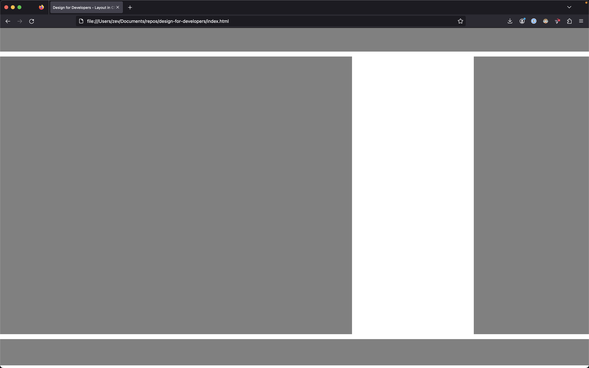
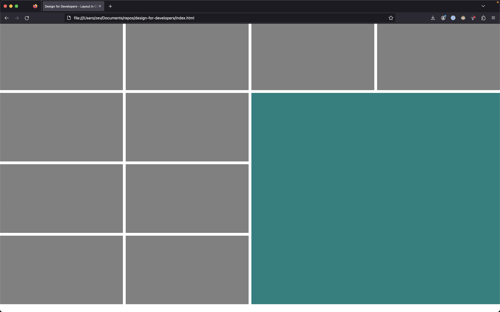

Watching this on June 2.

# Ideas/Traditions

"Make and break the grid." (book: Making and Breaking the Grid)

Swiss design.

# Practices

Don't design in the browser! Give yourself the ability to experiment before you feel locked into a design. It separates the content and code from the design.

# Tools

## Photoshop

Use layers, use marquee tool and fill.

### kb shortcuts

- v: move objects around
- m: marquee (shift + m for non-square)
- G: paint bucket
- shift + G: gradient
- d: default colors
- x: shift between foreground and background
- t: text
- i: eyedropper
- command + t: transform

# CSS
- https://gridbyexample.com
- https://labs.jensimmons.com
  - super cool diagonal "Swiss" layout
    - surprisingly small amount of code
- https://cssgridgarden.com

## Really Simple Full Layout Using Grid Template



### styles.css
```css
.item-a {
    grid-area: header;
}

.item-b {
    grid-area: main;
}

.item-c {
    grid-area: sidebar;
}

.item-d {
    grid-area: footer;
}

section {
    display: grid;
    width: 100vw;
    height: 100vh;
    grid-column-gap: 10px;
    grid-row-gap: 15px;
    grid-template-areas: 
      "header header header header header"
      "main main main . sidebar"
      "footer footer footer footer footer";
    ;
    grid-template-rows: 80px auto 80px;
}

div {
    background: grey;
}
```

### index.html > body

```html
<section>
    <div class="item item-a"></div>
    <div class="item item-b"></div>
    <div class="item item-c"></div>
    <div class="item item-d"></div>
</section>
```

## Nice Layout With Different Sized Boxes Using Grid Area



### css

```css
.item-a {
    background: teal;
    /* grid-column-start: 2; */
    /* grid-column-end: span 3; */
    /* grid-row-start: 3; */
    /* grid-row-end: span 2; */
    grid-area: 2 / 3 / span 3 / span 2;

}


section {
    display: grid;
    width: 100vw;
    height: 100vh;
    grid-column-gap: 10px;
    grid-row-gap: 10px;
    grid-template-columns: repeat(4, 1fr);
    grid-template-rows: repeat(4, 1fr);
}

div {
    background: grey;
}
```

